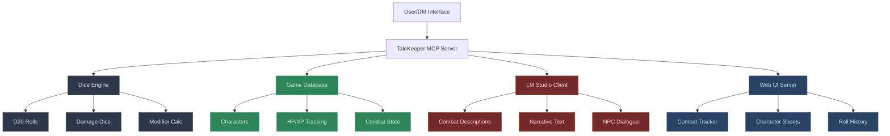

# **Sisteama TaleKeeper Implementation Plan**

## **System Architecture Overview**

Based on your requirements and the MCP documentation, here's the comprehensive plan for building your D&D agent flow system:

### **Core Components**

1. **Deterministic Dice Engine** - Pure Python logic for all D&D mechanics
2. **Game Database** - SQLite for persistent character/game state
3. **TaleKeeper MCP Server** - Central orchestrator using MCP protocol
4. **LM Studio Integration** - HTTP client for narrative generation
5. **Web UI** - Real-time dashboard for game visualization



## **Phase 1: Foundation (High Priority)**

### **1. Python Environment Setup**
```bash
# In D:\Code\Sisteama\
python -m venv venv
venv\Scripts\activate
pip install "mcp[cli]" fastapi uvicorn sqlite3 requests pydantic
```

### **2. Dice Engine (`core/dice_engine.py`)**
```python
class DiceEngine:
    def roll_d20(self, modifier=0, advantage=False, disadvantage=False)
    def roll_damage(self, dice_string, modifier=0)  # e.g., "2d6+3"
    def calculate_attack(self, attack_bonus, target_ac)
    def calculate_saving_throw(self, save_bonus, dc)
```

### **3. Database Schema (`core/database.py`)**
```sql
-- Characters table
CREATE TABLE characters (
    id INTEGER PRIMARY KEY,
    name TEXT,
    class TEXT,
    level INTEGER,
    hp_current INTEGER,
    hp_max INTEGER,
    ac INTEGER,
    stats JSON,  -- STR, DEX, CON, INT, WIS, CHA
    modifiers JSON
);

-- Combat encounters
CREATE TABLE encounters (
    id INTEGER PRIMARY KEY,
    name TEXT,
    active BOOLEAN,
    round_number INTEGER,
    current_turn INTEGER
);

-- Experience tracking
CREATE TABLE experience_log (
    character_id INTEGER,
    encounter_id INTEGER,
    xp_gained INTEGER,
    timestamp DATETIME
);
```

### **4. MCP Server (`core/mcp_server.py`)**
Using FastMCP from the documentation:
```python
from mcp.server.fastmcp import FastMCP

mcp = FastMCP("TaleKeeper")

@mcp.tool()
def roll_attack(character_name: str, target_ac: int, weapon: str) -> dict:
    """Roll an attack for a character against a target AC"""
    
@mcp.tool()
def update_hp(character_name: str, damage: int, heal: bool = False) -> dict:
    """Update character hit points"""
    
@mcp.tool()
def start_combat(participants: list[str]) -> dict:
    """Initialize a new combat encounter"""
```

## **Phase 2: Integration (Medium Priority)**

### **5. LM Studio Integration (`core/lm_studio_client.py`)**
```python
class LMStudioClient:
    def __init__(self, base_url="http://localhost:1234"):
        self.base_url = base_url
    
    def generate_combat_description(self, attack_result, context):
        """Generate narrative description of combat actions"""
    
    def generate_npc_dialogue(self, npc_name, situation):
        """Generate NPC responses and dialogue"""
```

### **6. Web UI (`web/app.py`)**
- FastAPI backend serving real-time updates
- WebSocket connections for live combat tracking
- Character sheet display
- Roll history and combat log

### **7. TaleKeeper Orchestrator (`flows/talekeeper.py`)**
```python
class TaleKeeper:
    def __init__(self):
        self.dice_engine = DiceEngine()
        self.database = Database()
        self.lm_client = LMStudioClient()
    
    def process_combat_action(self, action_type, params):
        # 1. Validate action with deterministic rules
        # 2. Roll dice for resolution
        # 3. Update database state
        # 4. Generate narrative with LM Studio
        # 5. Return structured result
```

## **Phase 3: Advanced Features (Lower Priority)**

### **8. Combat System**
- Initiative tracking
- Spell slot management
- Condition effects (prone, stunned, etc.)
- Area of effect calculations

### **9. Character Management**
- Leveling up mechanics
- Equipment management
- Skill proficiencies
- Background and trait tracking

## **Key Implementation Details**

### **MCP Tools Structure**
Based on the documentation, each tool will return structured data:
```python
@mcp.tool()
def roll_attack(character_name: str, target_ac: int) -> AttackResult:
    """Roll attack with full combat resolution"""
    return AttackResult(
        hit=True,
        roll=15,
        damage=8,
        critical=False,
        description="The sword strikes true!"
    )
```

### **LM Studio Integration**
```python
# HTTP requests to local LM Studio server
def get_narrative(self, prompt: str) -> str:
    response = requests.post(
        f"{self.base_url}/v1/chat/completions",
        json={
            "messages": [{"role": "user", "content": prompt}],
            "temperature": 0.7
        }
    )
    return response.json()["choices"][0]["message"]["content"]
```

### **Database Operations**
All game state changes go through the database layer, ensuring persistence and enabling rollback capabilities.

## **Testing Strategy**

1. **Unit Tests** - Each component tested independently
2. **MCP Client Testing** - Use `uv run mcp dev` for development
3. **Claude Desktop Integration** - Configure as MCP server
4. **Web UI Testing** - Local browser testing with mock data

## **TODO List Status**

- [x] Research project structure
- [x] Design system architecture
- [ ] Set up Python environment and dependencies
- [ ] Create dice engine
- [ ] Setup database schema
- [ ] Implement MCP server
- [ ] Integrate LM Studio
- [ ] Create web UI
- [ ] Implement TaleKeeper orchestrator
- [ ] Add combat system
- [ ] Create character management
- [ ] Test integration

This architecture gives you a robust, scalable D&D agent system that separates deterministic game mechanics from AI-generated narrative content!
